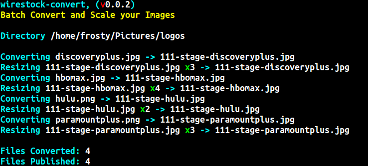

# wirestock-convert
Batch Convert and Scale your Images

## Install
- After downloading / cloning just run **npm install**
- You will need an image scaler, I put the one I use down below
- You will have to modify the hard coded paths 
(I put the image scaler in /usr/bin and the models in /usr/share/models)

## AI Image Scaler
I use **realesrgan-ncnn-vulkan** to scale the images (renamed to upscale) 
https://github.com/xinntao/Real-ESRGAN-ncnn-vulkan 

## Modifying the scaler
Modify **const upscaleCmd** to change the scaler command or get **realesrgan-ncnn-vulkan** and rename it to upscale

### This is offered for use under the MIT license.  
(Use it however you want)
